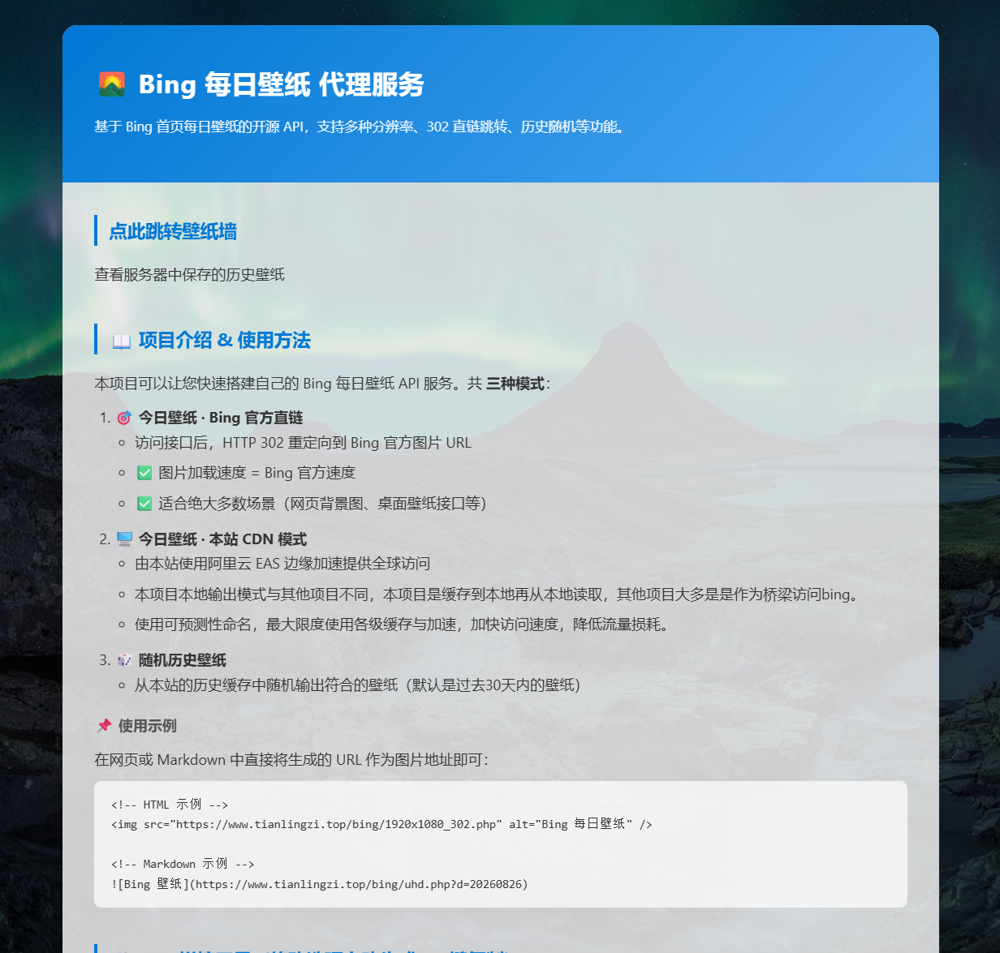
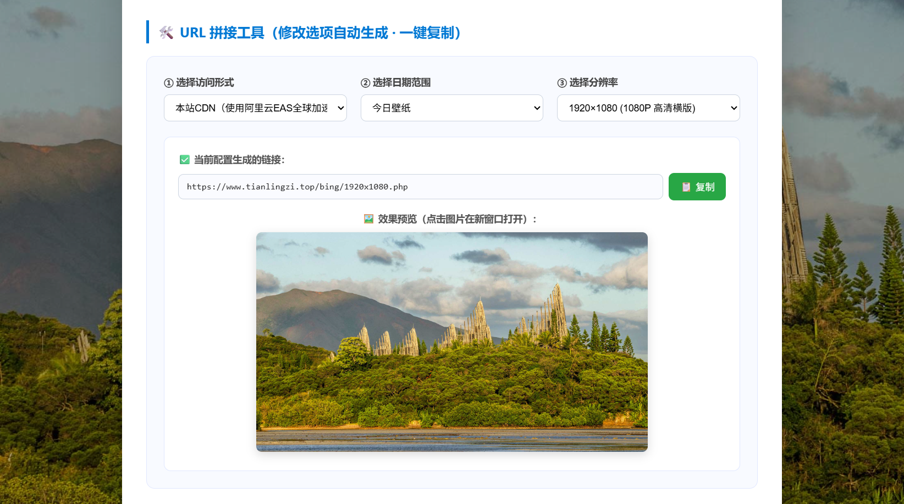
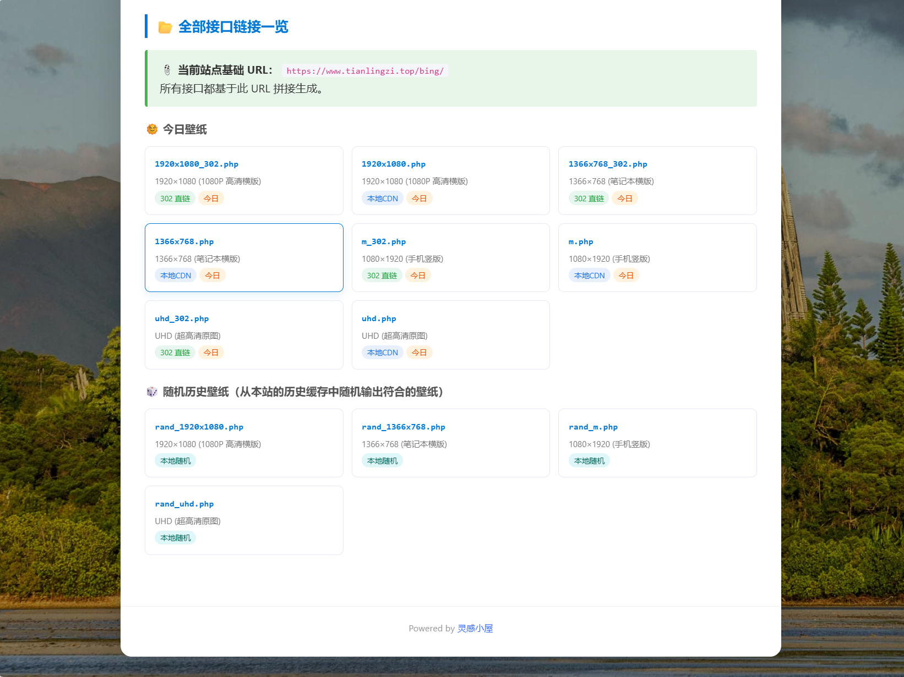
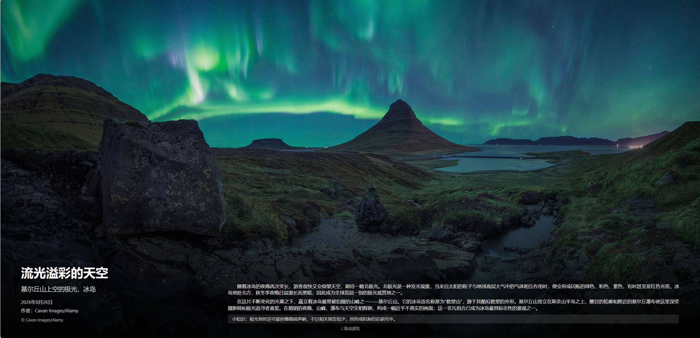
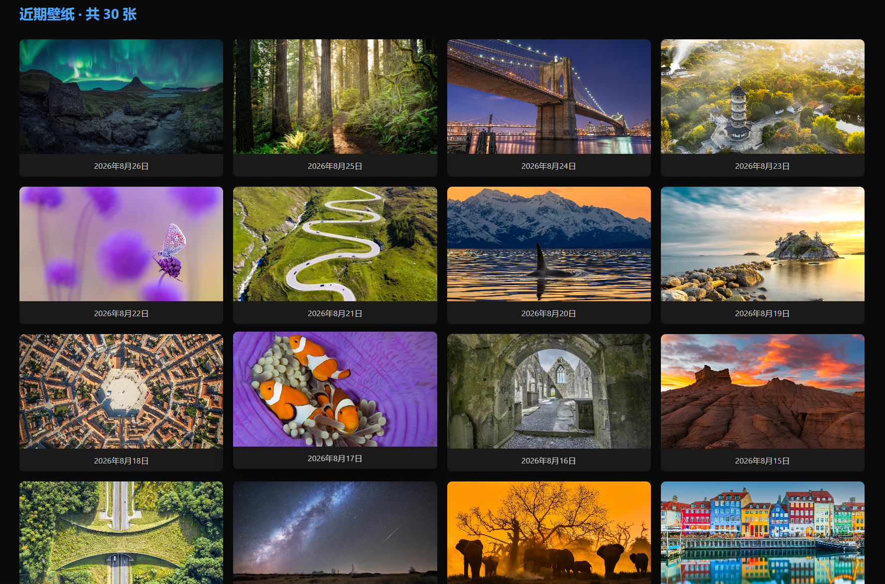
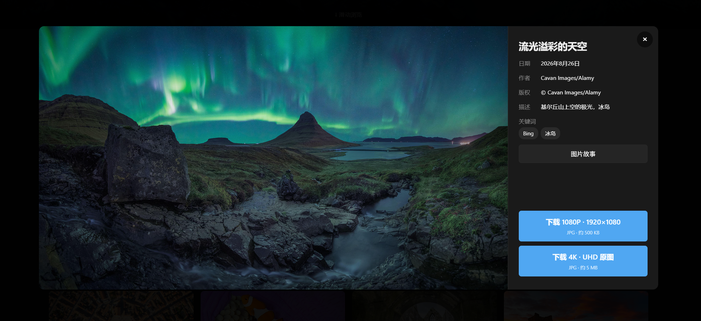
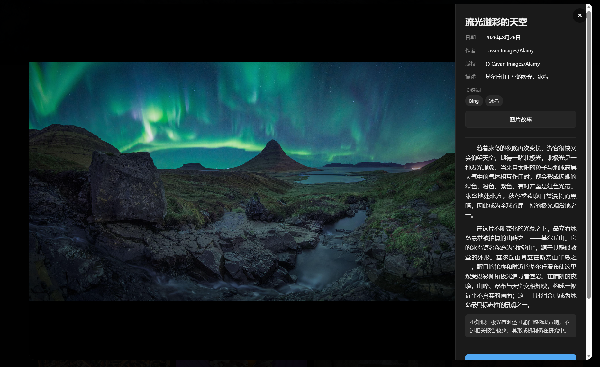

## 🌟 简介

Bing首页每日都会更新一张来自世界各地的精美图片。通过 **[www.tianlingzi.top](http://www.tianlingzi.top)** 提供的API链接，您可以简单、快速地获取这些栩栩如生的每日壁纸。这些壁纸每日自动更新，无论是作为网站背景还是电脑桌面壁纸，都是非常不错的选择，为您的数字生活增添一份色彩。

项目创建有引导页，提供介绍、链接生成、链接说明、跳转壁纸墙等功能。
壁纸墙可以查看服务器中保存的壁纸，提供下载功能。照片墙中的壁纸提供详细信息：壁纸时间、作者、标题、描述、介绍、小知识等。

项目在下载壁纸时，会将壁纸基础信息通过xmp元数据保存到图片中，方便用户查看。

## 🌐 项目主页

您可以直接在浏览器中输入以下地址，访问本项目主页，体验每日壁纸服务：

- **项目主页：** [https://www.tianlingzi.top/bing](https://www.tianlingzi.top/bing/)
- **项目壁纸墙：** [https://www.tianlingzi.top/bing/bashboard.php](https://www.tianlingzi.top/bing/bashboard.php/)

更多项目介绍和技术细节，请访问本人博客介绍页面：

- **博客介绍：** [https://www.tianlingzi.top/archives/278/](https://www.tianlingzi.top/archives/278/)

## 💡 代码开源

开源，是一种互联网精神。本着取之于民用之于民的原则，本项目代码已在Github上完全开源，欢迎大家查阅、学习和贡献：

- **GitHub仓库：** <https://github.com/tianlingzi/bing>

**重要提示：**

*   **PHP直接输出图片** 的方式，图片流量会经过您的服务器，因此速度会受限于服务器的带宽和性能。这里和别的项目不同，别的项目基本是作为桥梁，用服务器代理到Bing，本项目是下载到本地，再通过静态资源访问获取。并且使用标准化可构建式命名，在php端直接构建访问链接，可以尽可能地利用到用户本地浏览器缓存、CDN等降速。又可以保证可以获取到最新的壁纸。另外，服务器每天都需要运行一次 daily_download.php 脚本，将最新的Bing壁纸下载到本地。
运行方式：php daily_download.php
*   **跳转至Bing图片直链** 的方式使用。这种方式直接输出Bing图片的原始直链，图片访问不占用您服务器的流量，速度不受服务器影响，通常更快、更好用。
*   `www.tianlingzi.top` 服务本身已启用阿里云EAS全球加速，理论上直接使用本站API的速度也相当快。

如果您不想自己部署代码，可以直接使用 `www.tianlingzi.top` 提供的API服务，方便快捷。

## 🔗 bing体验链接：

本站API服务：

- <https://www.tianlingzi.top/bing/1920x1080.php>
- <https://www.tianlingzi.top/bing/1366x768.php>
- <https://www.tianlingzi.top/bing/m.php>
- <https://www.tianlingzi.top/bing/uhd.php>

本站API服务（随机壁纸）：

- <https://www.tianlingzi.top/bing/rand_1920x1080.php>
- <https://www.tianlingzi.top/bing/rand_1366x768.php>
- <https://www.tianlingzi.top/bing/rand_m.php>
- <https://www.tianlingzi.top/bing/rand_uhd.php>

跳转至Bing图片直链

- <https://www.tianlingzi.top/bing/1920x1080_302.php>
- <https://www.tianlingzi.top/bing/1366x768_302.php>
- <https://www.tianlingzi.top/bing/m_302.php>
- <https://www.tianlingzi.top/bing/uhd_302.php>

php直接输出图片链接不提供体验链接，由于php直接输出图片，会占用服务器流量，跳转至Bing图片直链不会不占用服务器的流量。

## 🛠️ 使用方法

本API接口的链接可以直接作为图片URL链接来使用，方便地嵌入到您的网页或应用中。
以下是两种主要的使用方式：

### 🖼️ PHP直接输出图片

这种方式会通过您的服务器代理图片输出，适用于需要服务器端处理或缓存的场景。

```html
<!-- 1080P高清壁纸 -->


<!-- 1366x768分辨率壁纸 -->


<!-- 手机超高清竖版壁纸 -->


<!-- UHD超高清原图壁纸 -->

```

### ➡️ 跳转至Bing图片直链

这种方式会通过HTTP 302重定向到Bing官方的图片直链，不占用您的服务器流量，速度更快。

```html
<!-- 1080P高清壁纸直链 -->


<!-- 1366x768分辨率壁纸直链 -->


<!-- 手机超高清竖版壁纸直链 -->


<!-- UHD超高清原图壁纸直链 -->

```

## 项目部署
### 下载项目
将项目文件全部下载，存放到您的服务器上。
项目网页入口文件：`index.php`。其他：bashboard.php（壁纸墙）

### 安装依赖
1.安装php的sqlite扩展
2.安装Python
3.安装playwright
```bash
pip install playwright
playwright install chromium
# 服务器是 root 用户，需装系统依赖：
playwright install-deps
```
### 配置项目
修改`config.php`文件中的一些基础数据，如：`cache_filename_prefix`（文件名前缀）。

### 下载壁纸
使用php运行`daily_download.php`文件，下载壁纸、保存数据：
```bash
DISPLAY= php daily_download.php
```
因为项目调用 playwright 下载壁纸，运行过程中其会请求 X11 连接，因此使用`DISPLAY=`显性屏蔽请求。

运行完成后，cache目录下会有当日下载的壁纸，壁纸信息会分别保存到壁纸的xmp元数据和data目录下的db文件。

### 运行项目
服务器网页指向`index.php`文件，即可[访问项目主页](https://www.tianlingzi.top/bing/index.php)。
indexq.php可以跳转到项目中的所有地址。

### 示例图片








